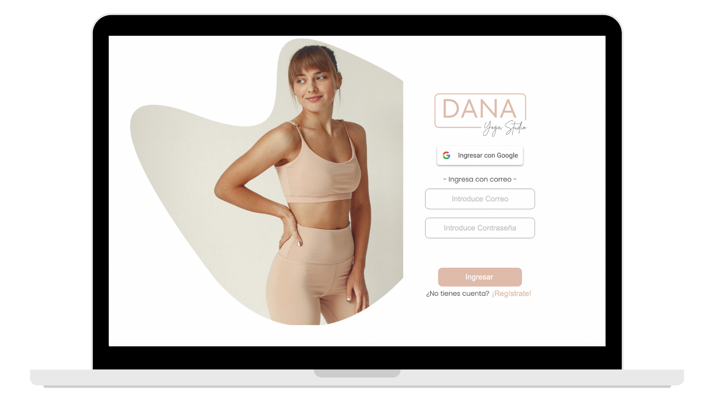
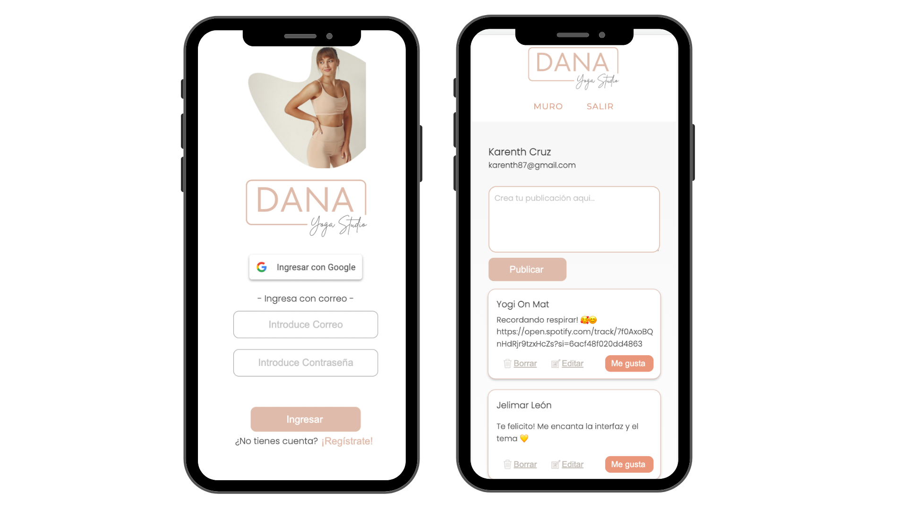
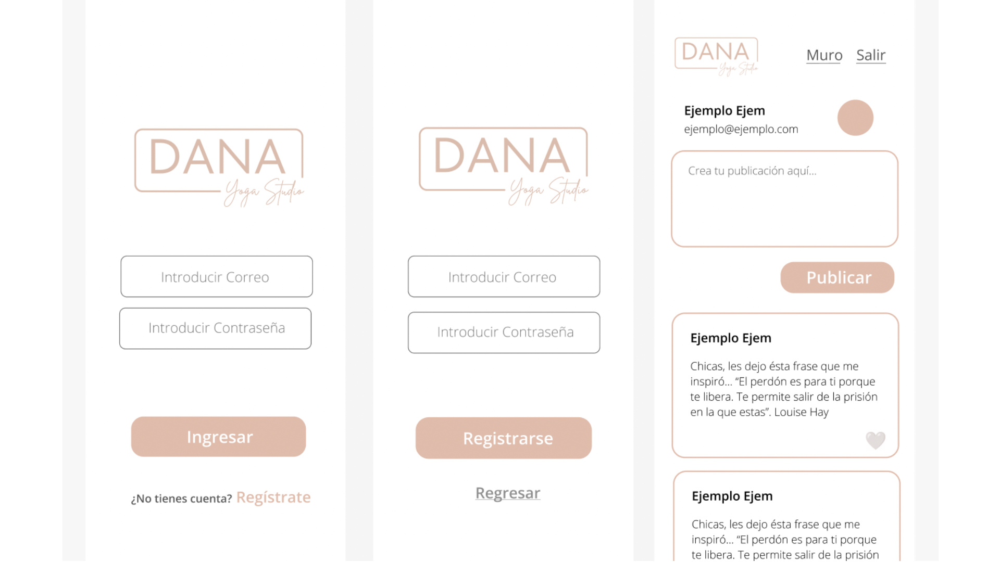
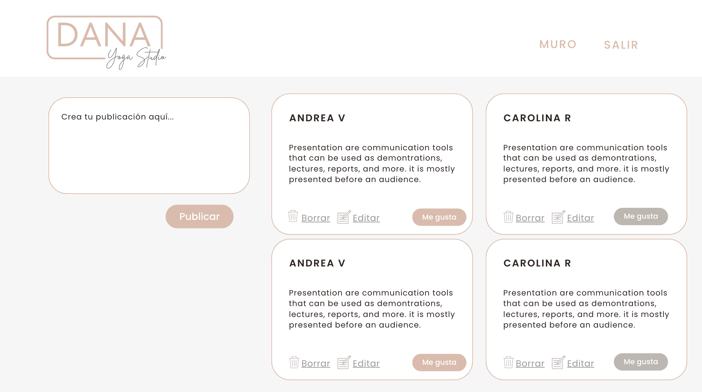

# Dana Yoga Studio

Red social para prácticantes de yoga

## Índice

* [1. Introducción](#1-Introducción)
* [2. Historias de Usuario](#2-Historias-de-usuario)
* [3. Prototipos](#3-Prototipos)
* [4. Test de Usabilidad](#4-Test-de-usabilidad)
* [5. Detalles Técnicos](#5-Detalles-técnicos)

## **1. Introducción

Dana yoga Studio es una red social, para aficionados y practicantes de yoga. Aquí podrás, compartir y encontrar frases de inspiración, playlist favoritas, citas célebres y libros recomendados por diferentes autores del mundo del yoga. Al usar la aplicación, podrás crear tus publicaciones, editar, borrar y dar like, interactuando con otros usuarios.  

## **2. Historias de Usuario

En este proyecto se busca construir una red social, que permita a los usuarios crear una cuenta, acceder con correo, ó botón de google, crear sus publicaciones, editarlas, borrarlas e interactuar através del botón de like. 

#### Historia de Usuario 1
Yo como usuario quiero crear una cuenta con correo electrónico y contraseña, también acceder con mi cuenta de google.
#### Historia de Usuario 2
Yo como usuario quiero ingresar con el correo electrónico y la contraseña registrada, ó poder acceder con mis credenciales de google y cerrar mi sesión. 
#### Historia de Usuario 3
Yo como usuario despues de acceder, quiero crear y compartir una publicación.
#### Historia de Usuario 4
Yo como usuario quiero editar, borrar y dar like a una publicación. 

## **3. Prototipos**

Para poder realizar la maquetación del proyecto, se crean los prototipos de la versión móvil y de escritorio. A continuación encontrarás los prototipos...

## **4. Test de usabilidad**
Los test de usabilidad se realizaron bajo el protitipo móvil, por medio de la herramienta Maze, donde se preguntó a un grupo de personas por medio de pruebas rápidas que simulaban la experiencia del usuario sobre cada click de la interfaz. Con el informe final de la plataforma se llevaron acabo los ajustes para:

* Botón de salir (Cambio de ícono por botón con palabra salir)
* Se ajustaron las fuentes y estilos de letras (para ir desde inicio a registrarse)
* Se cambia el tamaño de algunos de los botones para que sean más visibles

## **5. Detalles Técnicos**

Para este proyecto se realizó la implementación de:

* SPA (Single Page Application)
* Firebase y Cloud Firestore.
* Vanilla JS.
* CSS y HTML Semántico.
* Jest (Test Unitarios).

